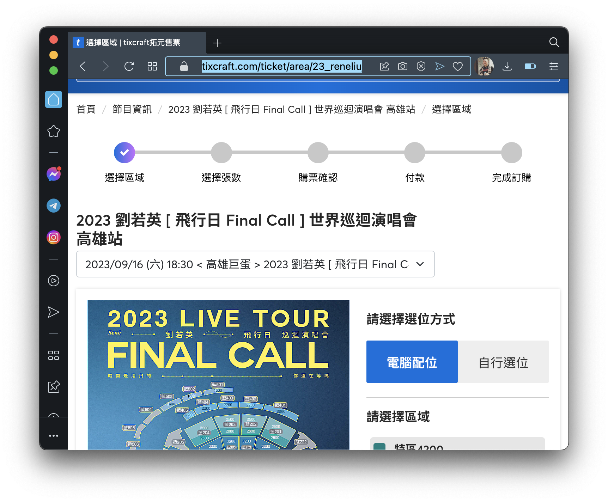
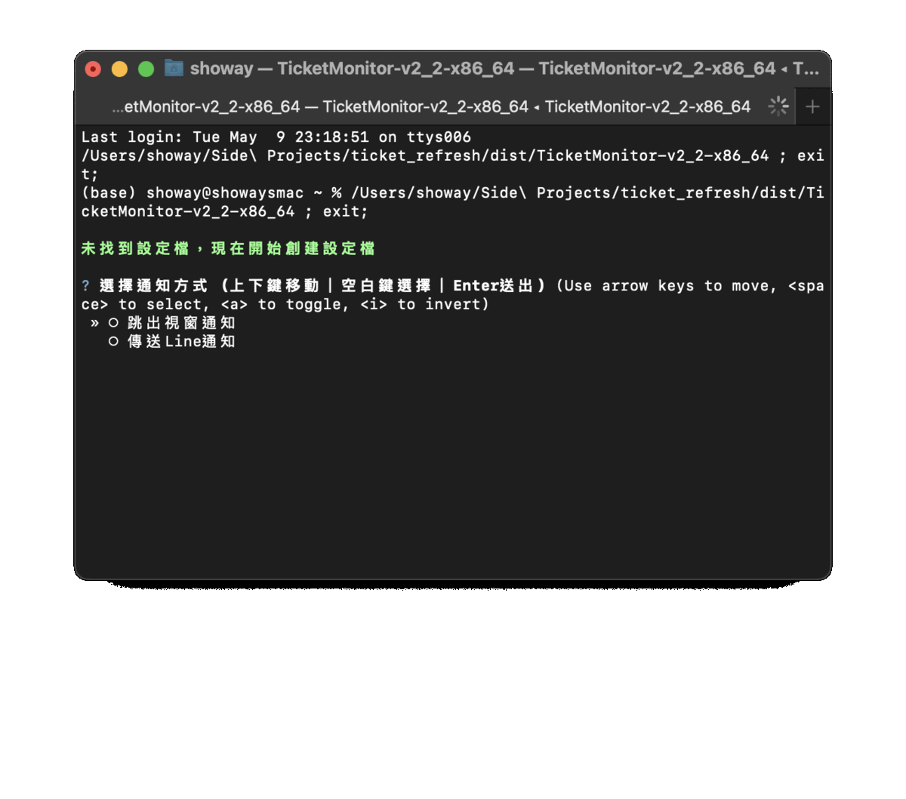
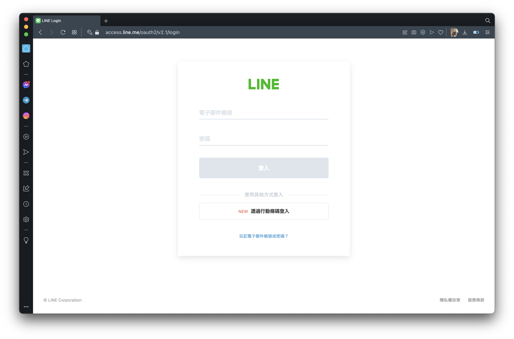
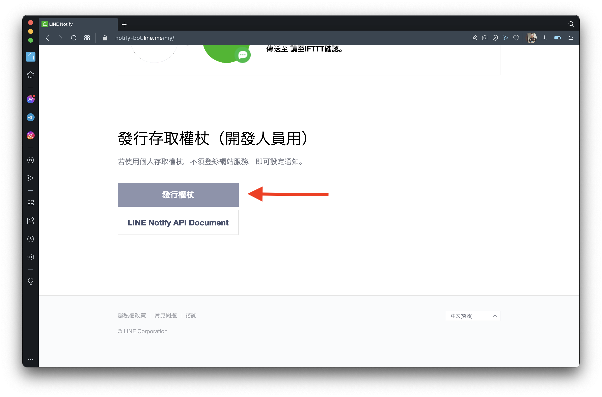
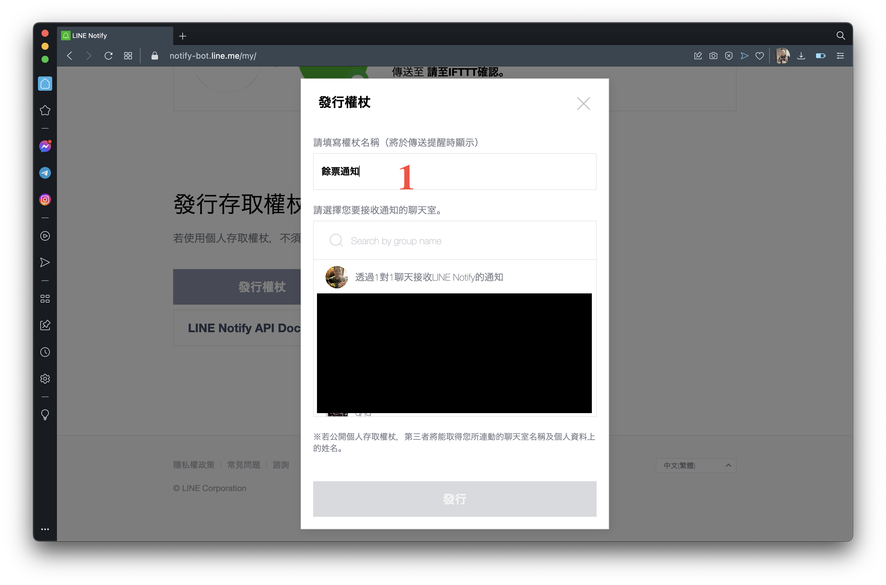
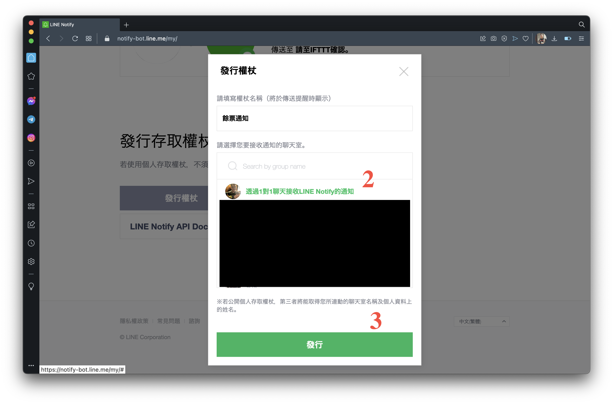
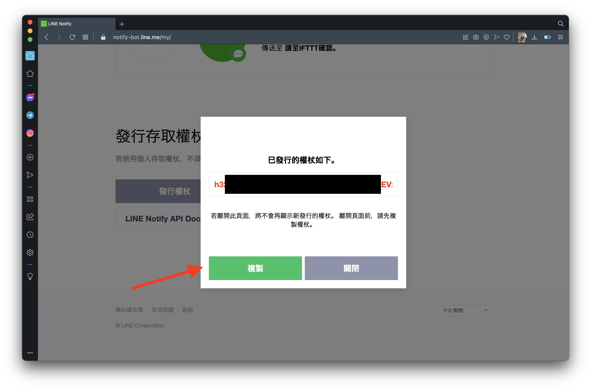

# Ticket Refresh 自動查看餘票

## 說明
> 監控拓元售票系統的餘券狀況，可以依照需求選擇跳窗提醒或是連動LINE Notify

### 使用source code 執行(建議使用虛擬環境)
1.
```
  conda create -n py311 python=3.11  #conda建立虛擬環境
  conda activate py311
```
2.
```
 pip3 install -r requirements.txt
```

3.
```
 python3 main.py
```

4. 依據終端機的詢問完成設定
5. 產生config.json檔並開始監控

### 執行
> 執行檔已經停止維護，若要使用最新版本請用source code執行

1. 請先至 [Releases](https://github.com/showaykerker/ticket_refresh/releases/tag/v2.1) 下載對應的壓縮檔並解壓縮
    * mac M1/M2 請選擇 “TicketMonitor-v2-arm.zip”
    * mac intel請選擇 “TicketMonitor-v2_2-x86_64.zip
2. 解壓縮後按著鍵盤control點擊TicketMonitor開啟，否則系統會因不信任而無法執行

 

#### 設定通知方式、監看活動、監看範圍
* 找好要監看的網址，e.g. https://tixcraft.com/ticket/area/23_reneliu/14411 


* 跟著終端機中的提示輸入通知方式、監看的活動和範圍
* 若需要重新設定可以直接更改config.json或是刪除後重新跑執行檔生成
* 若需要使用Line通知，請參考[#設定line通知](#設定line通知)
* 若沒票會顯示ＸＸ區域No tickets available，幾秒過後會再重新載入一次，直到刷到票會依據設定跳出剩餘票券的視窗或是傳送Line通知


#### 設定Line通知
1. 進入[Line Notify](https://notify-bot.line.me/my/)

3. 點選「發行權杖」

4. 權杖名稱輸入「餘票通知」

5. 聊天室選擇「透過1對1聊天接收Line Notify的通知」

6. 記下權杖



### Note
* 開啟後需要一點時間載入！
* 這支程式只能監控有分區域的票種，可以看下面範例圖，若是單一票種沒有分區域則不適用  
* 若執行檔可以成功執行，可將TicketMonitor和config.json以外的檔案都清除

### 進階使用

#### 以config檔設定網址和監聽範圍
在 `config.json` 裡的"target"欄位分別填入
1. "url": 查詢到的網址，須包含雙引號
2. "group_ids": 需要監看的票區，格式為 `["group_#", "group_#"]`

#### Build for x86_64 with config file using pyinstaller
1. 
```
  virtualenv ticket_env  #建立虛擬環境
  win: ticket_env\Scripts\activate   #進入虛擬環境
  macOS: source ./ticket_env/bin/activate
```
2.
```
  pip3 install -r requirements.txt
```
3. 
```
  pyinstaller --clean --onefile main.py
```

### TODO
- [ ] AWS distribution guide.
- [ ] 其他售票網站
- [ ] 其他通知方式
- [x] 詢問是否使用舊的config，若否詢問是否沿用權杖