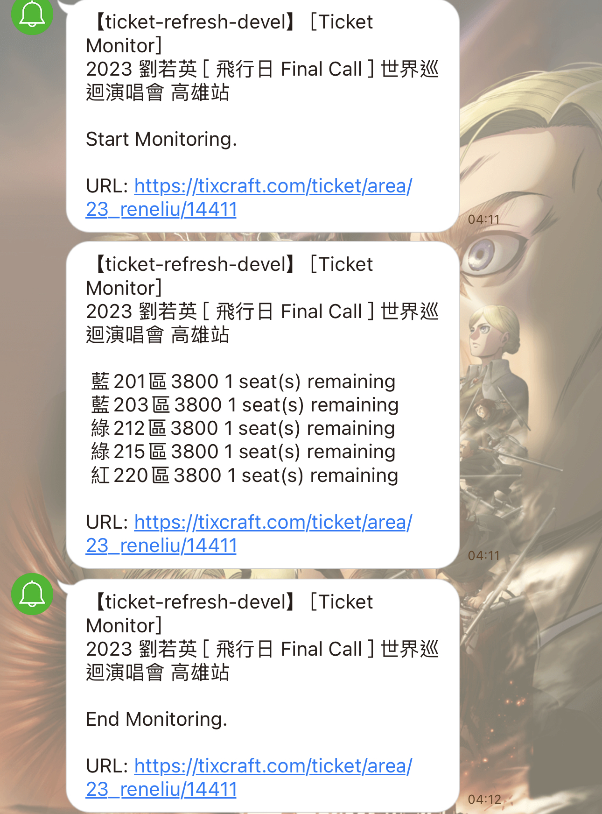

# Ticket Refresh 自動查看餘票

## 說明

### 版本

1. 請先點“TicketMonitor.zip”進入後，downloads後解壓縮  
    * mac M1/M2 請選擇 “TicketMonitor-arm.zip”
    * mac intel請選擇 “TicketMonitor-v2-x86_64.zip”

2. 進到執行檔後按著鍵盤control點擊TicketMonitor開啟，否則系統會因不信任而無法執行


### 開啟後需要一點時間載入！

> 這支程式只能監控有分區域的票種，可以看下面範例圖，若是單一票種沒有分區域則不適用  

> 若執行檔可以成功執行，可將TicketMonitor以外的檔案都清除

> 若使用v2，則需留下執行檔和config.json

### 使用執行檔
1. 直接開啟執行檔
    * mac M1/M2 請選擇 “TicketMonitor-arm”
    * mac intel請選擇 “TicketMonitor-v2-x86_64”
2. 輸入要監聽的網址
3. 輸入要監聽範圍（看以下範例）
4. 若沒票會顯示ＸＸ區域No tickets available，幾秒過後會再重新載入一次，直到刷到票會跳出剩餘票券的視窗

### 查詢監聽範圍
1. 到網頁按右鍵點選inspect打開開發者工具

2. 用開發者工具左上角的游標定位票種的tag

3. 記起來是group_多少，之後可以帶入到監聽範圍


### 以config檔設定網址和監聽範圍
在[config.json](config.json)裡的"target"欄位分別填入
1. "url": 查詢到的網址，須包含雙引號
2. "start": 起始group，不含雙引號
3. "end": 終止group，不含雙引號

### 設定Line通知
1. 進入[Line Notify](https://notify-bot.line.me/my/)
2. 點選「發行權杖」
3. 權杖名稱輸入「餘票通知」
4. 聊天室選擇「透過1對1聊天接收Line Notify的通知」
5. 按下發行後將權杖的一串字複製下來，貼到[config.json](config.json)的“token”->"line"中，記得保留前後雙引號
6. 確認[config.json](config.json)中"notification_type"->"line"為沒有雙引號的小寫true
7. 若設定成功且開始執行，line將會收到以下通知


### 本機執行建議先用虛擬環境(使用source code 執行)
1.
```
  virtualenv ticket_env  #建立虛擬環境
  win: ticket_env\Scripts\activate   #進入虛擬環境
  macOS: source ./ticket_env/bin/activate
```
2.
```
 pip3 install -r requirements.txt
```

3.
```
 python3 main.py
```
> arm架構晶片pyqt5需使用brew安裝！

4. 終端機會詢問要監聽的網址，輸入完按enter
再來會詢問監聽的票券範圍，較大的場館都會分不同票種 ，拓元官網HTML會使用id=group_numbe來編號，請使用瀏覽器進入開發者設定查詢，若只想監聽單一票種，監聽範圍請輸入一樣的數字就好
ex:
```
HTML
<ul id="group_0" class="area-list" style=""><li><span style="background: #005fbf;">&nbsp;</span><font color="#AAAAAA">特A1區4200 Sold out</font></li><li><span style="background: #005fbf;">&nbsp;</span><font color="#AAAAAA">特A2區4200 Sold out</font></li><li><span style="background: #56aaff;">&nbsp;</span><font color="#AAAAAA">特B區3800 Sold out</font></li></ul>
```
這時候範圍都輸入0就好了。

## 開發指引
### Build for x86_64 with config file
1. 
```
  virtualenv ticket_env  #建立虛擬環境
  win: ticket_env\Scripts\activate   #進入虛擬環境
  macOS: source ./ticket_env/bin/activate
```
2.
```
  pip3 install -r requirements.txt
```
3. 
```
  // 由於需要讀入confic.json，用這個只另將config.json加入install的dist資料夾中
  pyinstaller --clean TicketMonitor-v2-x86_64.spec
```